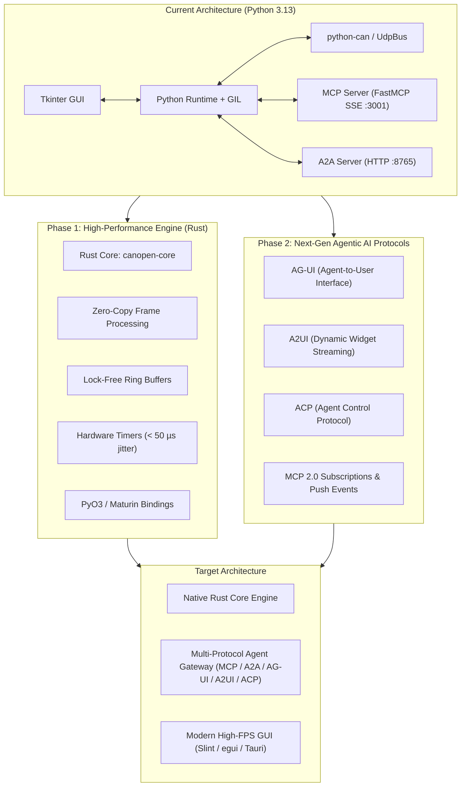

# CANopen Studio — Development Roadmap

This document outlines the strategic engineering roadmap for **CANopen Studio**. It details planned protocol expansions for agentic AI interaction and architectural evolution, notably the transition towards a high-performance compiled engine.

---

## 🎯 Executive Summary & Strategic Priorities

1. **High-Performance Core Engine (Preferred: Rust)**: Addressing architectural bottlenecks identified in the [baseline benchmarks](benchmarks.md) (Python GIL contention, heap allocation per frame, timer jitter) to achieve microsecond-level determinism and handle > 500,000 frames/sec.
2. **Next-Generation Agentic AI Protocols**: Expanding beyond the existing **MCP (Model Context Protocol)** and **A2A (Agent-to-Agent)** servers to natively support emerging agentic interaction standards (**AG-UI**, **A2UI**, and **Agent Control Protocol - ACP**).
3. **Automotive & Industrial Protocol Expansions**: Adding CANopen FD, UDS (ISO 14229) over ISO-TP, and automated DBC/EDS-driven decoding.



---

## 1. Engine Evolution: Migration to Compiled Core (Rust)

### 1.1. Motivation & Benchmark Findings
As documented in [`benchmarks.md`](benchmarks.md), the current Python implementation successfully validates the feature set and supports cross-machine bus bridging. However, empirical measurements reveal critical limitations for production automotive and industrial automation deployments:

* **Global Interpreter Lock (GIL) Contention**: The single-threaded execution lock causes serialization between the packet capture loop (`_rx_loop`), the Tkinter GUI render cycle (60 Hz), and asynchronous MCP JSON-RPC handlers.
* **Per-Frame Dynamic Allocations**: Packaging each message as a Python `can.Message` object and MessagePack dictionary generates heavy garbage collector overhead under high bus loads (> 10,000 frames/sec).
* **Timer Granularity**: Standard OS scheduler sleeping (`time.sleep()`) introduces ~2.6 ms of local scheduling jitter on nominal 20.0 ms (50 Hz) SYNC cycles.
* **Target Objective**: Throughput of **> 500,000 frames/second** with **< 50 µs timer jitter** and minimal CPU utilization (< 2% at full saturation).

### 1.2. Why Rust is Preferred
* **Zero-Cost Abstractions & Zero-Copy**: Direct mapping of binary CAN frames (`16-byte` packed structs: 32-bit CAN ID, 8-bit DLC, 8-bit flags, 64-bit timestamp, 8-byte payload) without heap allocation.
* **Memory Safety Without Garbage Collection**: Deterministic real-time execution with zero GC latency spikes.
* **Concurrency Model**: Lock-free single-producer multi-consumer (SPMC) ring buffers (`crossbeam-channel` or `ringbuf`) enabling decoupled high-speed reception, recording, and UI rendering.
* **Platform Network Primitives**: Direct control over interface binding (`IP_BOUND_IF` on macOS, `SO_BINDTODEVICE` on Linux), solving OS-level multicast sandbox restrictions natively.

### 1.3. Migration Phases

#### Phase 1A: Hybrid Architecture with Rust Extension (`PyO3`)
* Implement a standalone Rust library (`canopen-core`) containing:
  - CAN interface drivers (SocketCAN, native UDP unicast/multicast/broadcast, SLCAN parser).
  - High-speed trace ring buffer.
  - Latency tracker and 50 Hz SYNC generator with sub-millisecond precision.
* Expose Python bindings via **PyO3** and **Maturin**.
* The existing Tkinter GUI and MCP servers continue to run in Python, delegating heavy capture, decoding, and filtering to the compiled Rust extension.

#### Phase 1B: Full Native Application
* Transition the UI to a modern, lightweight GUI framework:
  - **Option 1 (Slint / egui)**: Fully compiled native binary with GPU acceleration, sub-millisecond redraw latency, and zero web dependencies.
  - **Option 2 (Tauri + Svelte/React)**: Native Rust backend with a flexible, modern web frontend for oscilloscope telemetry.

---

## 2. Advanced Agentic AI Protocols

CANopen Studio already provides two complementary agent interfaces:
- **MCP (Model Context Protocol)**: Client-to-Tool model (Claude Code, Antigravity, LLM agents).
- **A2A (Agent-to-Agent)**: Peer-to-Peer discovery and JSON-RPC dispatch.

The roadmap extends this capabilities to emerging agentic interaction standards:

### 2.1. AG-UI (Agent-to-User Interface)
* **Concept**: Allows autonomous AI agents to actively collaborate with human operators by projecting dynamic visual context into the UI.
* **Capabilities**:
  - Agent-annotated oscilloscope traces: highlight anomalous payload byte changes during reverse engineering.
  - Interactive confirmation dialogs for critical actions (e.g. NMT Reset, SDO Write, OBD-II DTC clearing).
  - Live AI diagnostics panel displaying hypotheses, detected fault patterns, and suggested manual tests.

### 2.2. A2UI (Agent-to-UI / Agent-Driven UI Streaming)
* **Concept**: Decouples the user interface layout from the backend, allowing agents to dynamically generate and instantiate telemetry widgets on the fly.
* **Capabilities**:
  - Declarative widget generation (gauges, time-series charts, status indicators) based on discovered CANopen Object Dictionaries (EDS/DCF) or OBD-II PIDs.
  - Real-time streaming of UI component states over SSE or WebSocket.
  - Bi-directional synchronization: changes made by the user in a widget are instantly surfaced to the agent, and agent-driven automated scripts manipulate UI controls seamlessly.

### 2.3. Agent Control Protocol (ACP)
* **Concept**: Standardized open execution and orchestration protocol for AI coding and debugging agents.
* **Capabilities**:
  - Session lifecycle management: start, pause, resume, or replay recorded CAN traces under agent direction.
  - Step-by-step diagnostic workflows with explicit capability negotiation (read-only monitoring vs active transmission).
  - Standardized audit trail recording all agent-generated CAN frames and operator approvals for regulatory compliance and safety.

### 2.4. MCP 2.0 Streaming Subscriptions
* Upgrade the MCP server from polling tools (`get_status()`, `get_trace()`) to **Server-Sent Event (SSE) Push Subscriptions**:
  - Real-time anomaly alerts (e.g., unexpected NMT state change, Heartbeat timeout, emergency telegrams `0x081`..`0x0FF`).
  - Bus error rate alerts and latency threshold triggers.

---

## 3. Protocol & Hardware Expansions

| Feature | Target Milestone | Description |
| :--- | :---: | :--- |
| **CANopen FD Support** | v0.4.0 | Support for flexible data-rate frames up to 64 bytes payload (CiA 1301). |
| **UDS (ISO 14229) over ISO-TP** | v0.4.0 | Full automotive diagnostics session control, ECU flashing, and security access routines. |
| **DBC / EDS / DCF Importer** | v0.3.5 | Import industry-standard database files to decode proprietary proprietary CAN frames into engineering units. |
| **PCAP / PCAPng Export** | v0.3.5 | Wireshark-compatible packet capture export with CAN subdissectors. |
| **Edge ML Anomaly Detection** | v0.5.0 | Embedded ONNX runtime in the Rust core for local unsupervised anomaly detection on high-speed bus traffic. |

---

## 4. Milestone Timeline

```text
2026 Q3 (Current):
  ├── v0.2.x: OBD-II Diagnostics, MCP Integration, Bus Latency & Jitter Monitor (Python baseline)
  └── Baseline benchmarks documented (benchmarks.md)

2026 Q4:
  ├── Phase 1A: Initial 'canopen-core' Rust crate with PyO3 bindings
  ├── UDP Broadcast / Unicast high-speed engine in Rust
  └── MCP 2.0 streaming subscriptions for anomaly alerts

2027 Q1:
  ├── Phase 2: AG-UI and A2UI streaming implementation
  ├── Agent Control Protocol (ACP) support
  └── CANopen FD & ISO-TP / UDS stack

2027 Q2+:
  └── Phase 1B: Standalone compiled native GUI application (Rust)
```
