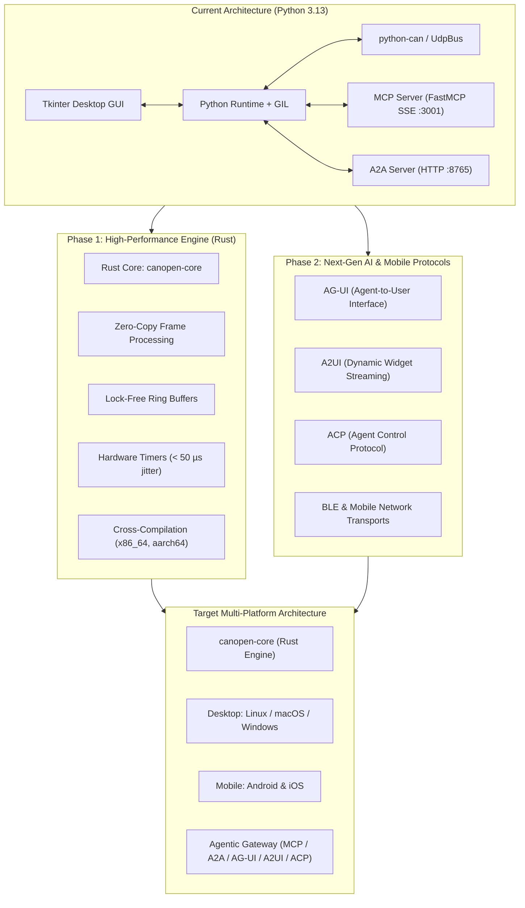
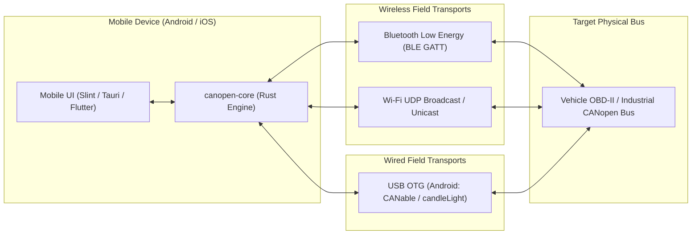

# CANopen Studio — Development Roadmap

This document outlines the strategic engineering roadmap for **CANopen Studio**. It details planned protocol expansions for agentic AI interaction and architectural evolution, notably the transition towards a high-performance compiled engine.

---

## 📍 Where the project actually is

**Current release: v0.8.1.** The compiled-engine transition this document was written to plan is **done**, a year ahead of the timeline below as it originally stood.

| Delivered | Release | Notes |
| :--- | :---: | :--- |
| Rust core `canopen-core` with PyO3 bindings (Phase 1A) | v0.5.0 | Frames, SDO, PDO, NMT, EDS, ISO-TP, OBD-II, UDP transport, virtual simulator |
| OBD-II diagnostics (SAE J1979), ELM327 and native ISO-TP backends | v0.5.0 | Vehicle profiles, gated writes, GUI tab, ten `obd_*` MCP tools |
| DBC / EDS / DCF importer | v0.5.0 | EDS parser in Rust; DBC through the optional `cantools` extra |
| Native Slint studio (Phase 1B, desktop) | v0.7.0 | Brought level with the Python studio: SDO download, PCAP-NG, VCD |
| SLCAN transport in Rust | v0.7.0 | CANUSB, USBtin, CANable |
| PCAP-NG export and Wireshark extcap | v0.7.0 | `LINKTYPE_CAN_SOCKETCAN`; buses appear in Wireshark's interface list |
| VCD waveform export and bitstream decoder | v0.8.0 | Write a frame onto the wire and read one back off it, with CRC and ACK |

Everything below that is not marked delivered is still ahead. The nearest items are **CAN FD**, **UDS over ISO-TP**, and **BLE** — the last of which gates the entire mobile port, since BLE is the only wireless path to an iPhone that does not require Apple MFi certification.

---

## 🎯 Executive Summary & Strategic Priorities

1. **High-Performance Core Engine (Rust)** — ✅ **delivered in v0.5.0, native front end in v0.7.0**. Addressed the architectural bottlenecks identified in the [baseline benchmarks](https://s-celles.github.io/canopen-studio/benchmarks/) (Python GIL contention, heap allocation per frame, timer jitter). What remains here is protocol breadth, not architecture.
2. **Mobile Deployment (Android & iOS)**: Porting the application to mobile smartphones using a shared cross-platform compiled core, supporting Bluetooth Low Energy (BLE), Wi-Fi UDP, and USB OTG.
3. **Next-Generation Agentic AI Protocols**: Expanding beyond the existing **MCP (Model Context Protocol)** and **A2A (Agent-to-Agent)** servers to natively support emerging agentic interaction standards (**AG-UI**, **A2UI**, and **Agent Control Protocol - ACP**).
4. **Automotive & Industrial Protocol Expansions**: Adding CANopen FD, UDS (ISO 14229) over ISO-TP, and automated DBC/EDS-driven decoding.



---

## 1. Engine Evolution: Migration to Compiled Core (Rust)

### 1.1. Motivation & Benchmark Findings
As documented in [`benchmarks.md`](https://s-celles.github.io/canopen-studio/benchmarks/), the current Python implementation successfully validates the feature set and supports cross-machine bus bridging. However, empirical measurements reveal critical limitations for production automotive and industrial automation deployments:

* **Global Interpreter Lock (GIL) Contention**: The single-threaded execution lock causes serialization between the packet capture loop (`_rx_loop`), the Tkinter GUI render cycle (60 Hz), and asynchronous MCP JSON-RPC handlers.
* **Per-Frame Dynamic Allocations**: Packaging each message as a Python `can.Message` object and MessagePack dictionary generates heavy garbage collector overhead under high bus loads (> 10,000 frames/sec).
* **Timer Granularity**: Standard OS scheduler sleeping (`time.sleep()`) introduces ~2.6 ms of local scheduling jitter on nominal 20.0 ms (50 Hz) SYNC cycles.
* **Target Objective**: Throughput of **> 500,000 frames/second** with **< 50 µs timer jitter** and minimal CPU utilization (< 2% at full saturation).

### 1.2. Why Rust is Preferred
* **Zero-Cost Abstractions & Zero-Copy**: Direct mapping of binary CAN frames (`16-byte` packed structs: 32-bit CAN ID, 8-bit DLC, 8-bit flags, 64-bit timestamp, 8-byte payload) without heap allocation.
* **Memory Safety Without Garbage Collection**: Deterministic real-time execution with zero GC latency spikes.
* **Concurrency Model**: Lock-free single-producer multi-consumer (SPMC) ring buffers (`crossbeam-channel` or `ringbuf`) enabling decoupled high-speed reception, recording, and UI rendering.
* **Platform Network Primitives**: Direct control over interface binding (`IP_BOUND_IF` on macOS, `SO_BINDTODEVICE` on Linux), solving OS-level multicast sandbox restrictions natively.

### 1.3. Migration Phases

#### Phase 1A: Hybrid Architecture with Rust Extension (`PyO3`) — ✅ delivered, v0.5.0
* A standalone Rust library (`canopen-core`) containing:
  - CAN interface drivers (SocketCAN, native UDP unicast/multicast/broadcast, SLCAN parser).
  - High-speed trace ring buffer.
  - Latency tracker and 50 Hz SYNC generator with sub-millisecond precision.
* Expose Python bindings via **PyO3** and **Maturin**.
* The existing Tkinter GUI and MCP servers continue to run in Python, delegating heavy capture, decoding, and filtering to the compiled Rust extension.

#### Phase 1B: Full Native Application — ✅ delivered on desktop, v0.7.0
* **Slint** was chosen over Tauri: a fully compiled native binary, no web dependencies, and the same toolchain later targets Android and iOS. It lives in `crates/canopen-gui`.
* v0.7.0 brought it level with the Python studio where it had no reason to lag: SDO download, PCAP-NG and VCD export from the Rust sniffer, the Wireshark extcap, and the SLCAN serial transport.
* Still Python-only, and deliberately so for now: the OBD-II tab, the MCP and A2A servers, and the telemetry plotter.

---

## 2. Advanced Agentic AI Protocols

CANopen Studio already provides two complementary agent interfaces:
- **MCP (Model Context Protocol)**: Client-to-Tool model (Claude Code, Antigravity, LLM agents).
- **A2A (Agent-to-Agent)**: Peer-to-Peer discovery and JSON-RPC dispatch.

The roadmap extends this capabilities to emerging agentic interaction standards:

### 2.1. AG-UI (Agent-to-User Interface)
* **Concept**: Allows autonomous AI agents to actively collaborate with human operators by projecting dynamic visual context into the UI.
* **Capabilities**:
  - Agent-annotated oscilloscope traces: highlight anomalous payload byte changes during reverse engineering.
  - Interactive confirmation dialogs for critical actions (e.g. NMT Reset, SDO Write, OBD-II DTC clearing).
  - Live AI diagnostics panel displaying hypotheses, detected fault patterns, and suggested manual tests.

### 2.2. A2UI (Agent-to-UI / Agent-Driven UI Streaming)
* **Concept**: Decouples the user interface layout from the backend, allowing agents to dynamically generate and instantiate telemetry widgets on the fly.
* **Capabilities**:
  - Declarative widget generation (gauges, time-series charts, status indicators) based on discovered CANopen Object Dictionaries (EDS/DCF) or OBD-II PIDs.
  - Real-time streaming of UI component states over SSE or WebSocket.
  - Bi-directional synchronization: changes made by the user in a widget are instantly surfaced to the agent, and agent-driven automated scripts manipulate UI controls seamlessly.

### 2.3. Agent Control Protocol (ACP)
* **Concept**: Standardized open execution and orchestration protocol for AI coding and debugging agents.
* **Capabilities**:
  - Session lifecycle management: start, pause, resume, or replay recorded CAN traces under agent direction.
  - Step-by-step diagnostic workflows with explicit capability negotiation (read-only monitoring vs active transmission).
  - Standardized audit trail recording all agent-generated CAN frames and operator approvals for regulatory compliance and safety.

### 2.4. MCP 2.0 Streaming Subscriptions
* Upgrade the MCP server from polling tools (`get_status()`, `get_trace()`) to **Server-Sent Event (SSE) Push Subscriptions**:
  - Real-time anomaly alerts (e.g., unexpected NMT state change, Heartbeat timeout, emergency telegrams `0x081`..`0x0FF`).
  - Bus error rate alerts and latency threshold triggers.

---

## 3. Mobile Deployment: Android & iOS Port

A core strategic goal is enabling engineers, field technicians, and automotive diagnostics operators to run CANopen Studio directly on mobile devices (smartphones and tablets) without requiring a heavy workstation or laptop in the field.

### 3.1. Cross-Platform Core Strategy (Rust on Mobile)
Rather than maintaining separate native Android (Kotlin/Java) and iOS (Swift/Objective-C) protocol stacks:
* **Single Core Engine (`canopen-core`)**: The compiled Rust engine is cross-compiled as a shared library:
  - **Android**: Shared libraries (`.so`) compiled for `aarch64-linux-android`, `armv7-linux-androideabi`, and `x86_64-linux-android` via [`cargo-ndk`](https://github.com/bbqsrc/cargo-ndk).
  - **iOS**: Universal static framework (`.xcframework`) compiled for `aarch64-apple-ios` and `aarch64-apple-ios-sim` via [`cargo-apple`](https://github.com/Timnn/cargo-apple) or `xcodebuild`.
* **Zero Discrepancy**: 100% of the CAN protocol parsing, SDO/PDO state machines, OBD-II decoders, and ring buffer logic are shared across Desktop, Android, and iOS.

### 3.2. Physical Connectivity & Platform Constraints

Connecting a mobile phone to a physical CAN bus or OBD-II port presents platform-specific constraints:

| Transport Layer | Android Support | iOS Support | Technical Details & Limitations |
| :--- | :---: | :---: | :--- |
| **Wi-Fi (UDP / TCP)** | ✅ Full | ✅ Full | Supported natively using the `UdpBus` architecture (broadcast `192.168.x.255` or unicast) or Wi-Fi OBD-II dongles (e.g. ELM327 Wi-Fi / STN1170 on TCP/UDP port 35000). Zero OS permission barriers on either platform. |
| **Bluetooth Low Energy (BLE)** | ✅ Full | ✅ Full | Universal wireless connectivity. Utilizes GATT Nordic UART Service (NUS) or standard CAN-over-BLE characteristics. Works on iOS without Apple MFi hardware certification. |
| **Bluetooth Classic (SPP / RFCOMM)** | ✅ Full | ❌ Restricted | Supported on Android for legacy ELM327 Bluetooth adapters. On iOS, Bluetooth Classic SPP requires proprietary Apple MFi (Made for iPhone) hardware coprocessor authentication. |
| **USB Host / OTG (Wired)** | ✅ Full | ⚠️ Limited | Android supports direct USB OTG with CAN adapters (CANable / candleLight, USBtin, FTDI, CDC-ACM serial) via Android `UsbManager` in user-space (no root required). iOS requires Lightning/USB-C CCID/UAC adapters with specific external accessory entitlements. |



### 3.3. Cross-Platform UI Framework Evaluation
Three UI architectures are under active evaluation for the unified mobile + desktop interface:

1. **Slint (Recommended for automotive/embedded)**:
   - Native compilation to Rust binary with GPU acceleration (Skia or FemtoVG backend).
   - Minimal memory footprint (< 25 MB RAM) and ultra-responsive 120 fps touch gestures.
   - First-class toolchain for Android (`cargo apk`) and iOS targets.
2. **Tauri Mobile v2**:
   - Rust core powering a responsive web UI (Svelte / React / Tailwind) hosted inside system webviews (Android WebView & iOS WKWebView).
   - Excellent ecosystem for dynamic data visualizations, gauges, and graph plotting (Canvas/WebGL).
   - Rapid UI iteration with hot reload.
3. **Flutter with `flutter_rust_bridge`**:
   - High-performance Skia/Impeller rendering pipeline with rich mobile UI widgets.
   - Mature mobile ecosystem (camera, haptics, background services), bridging directly to `canopen-core`.

### 3.4. Mobile Edge AI & Field Diagnostics
Mobile deployment uniquely enables field-service agentic features:
* **Camera VIN & Barcode Scanning**: Instant optical recognition of vehicle VIN or industrial motor QR/barcode, automatically querying and loading relevant DBC / EDS / DCF definitions from local storage or cloud registries.
* **On-Device Diagnostics Assistant**: Running a quantized local model (via ExecuTorch or ONNX Runtime Mobile) or connecting to edge agents over ACP/MCP to guide field technicians through step-by-step troubleshooting.
* **Haptic & Audio Alerts**: Haptic feedback patterns on critical CAN bus alarms (emergency telegrams, bus-off events, unexpected DTC flags) when the phone is mounted on a vehicle cradle or in pocket.

---

## 4. Protocol & Hardware Expansions

| Feature | Status | Description |
| :--- | :---: | :--- |
| **DBC / EDS / DCF Importer** | ✅ v0.5.0 | EDS parser in the Rust core, generating PDO mappings straight from the TPDO/RPDO records. DBC through the optional `cantools` extra; a definition that cannot be expressed exactly is skipped with a reason rather than decoded into a plausible wrong number. |
| **PCAP / PCAPng Export** | ✅ v0.7.0 | PCAP-NG with `LINKTYPE_CAN_SOCKETCAN`, read natively by Wireshark and its CANopen / J1939 / ISO 15765 dissectors. `can-sniffer --pcap <file\|pipe>` writes a capture file, or streams live into a named pipe Wireshark is reading. |
| **Wireshark extcap** | ✅ v0.7.0 | `canopen-extcap` makes the studio's buses appear in Wireshark's own interface list on macOS and Windows. |
| **VCD Export & Bitstream Decoder** | ✅ v0.8.0 | Reconstruct the waveform a frame would have made, for PulseView — and the inverse, turning bits a probe saw back into a frame, with CRC verification and the ACK slot read rather than assumed. |
| **CAN FD Support** | 🚧 in progress | Flexible data-rate frames up to 64 bytes (ISO 11898-1). Groundwork landed: the core frame type carries FD payloads, the FD DLC encoding, BRS and ESI, and round-trips them through the `python-can` wire format. The layers that cannot yet handle a 64-byte frame refuse it explicitly rather than truncating it. PCAP-NG carries FD too, under the same `LINKTYPE_CAN_SOCKETCAN` — there is no separate FD link type; a reader tells the two apart by the record length and the `CANFD_FDF` flag. SLCAN carries FD as well, in the `d`/`D`/`b`/`B` dialect the CANable 2.0 firmware uses, and the FD CRC-17 and CRC-21 are implemented and checked against their published values. **Blocked on the standard — see below.** After that, CANopen FD (CiA 1301). Note there is no native SocketCAN transport in the Rust core to extend: SocketCAN reaches the studio through `python-can`. |
| **UDS (ISO 14229) over ISO-TP** | ⏳ planned | Session control, security access and ECU flashing. Today only the *refusal* exists: `WriteDataByIdentifier` (0x2E), `RoutineControl` (0x31) and `InputOutputControlByIdentifier` (0x2F) are named and rejected with no request path, so enabling one is a deliberate change rather than an accident. |
| **BLE Transport** | ⏳ planned | GATT Nordic UART Service. Gates the whole mobile port, and closes the gap that makes most OBD-II dongles sold today unusable with the studio. |
| **Edge ML Anomaly Detection** | ⏳ planned | Embedded ONNX runtime in the Rust core for local unsupervised anomaly detection on high-speed bus traffic. |

---

### 4.1. CAN FD framing: what it is waiting on

The bit-level FD framing is the one piece of CAN FD that is **blocked rather
than merely unwritten**, and it is worth saying why so nobody picks it up and
quietly gets it wrong.

Four details decide whether a frame this crate builds matches one a controller
builds. Every one of them survives a round trip against our own encoder: invert
the parity and the bits still decode perfectly in our tests while matching
nothing on a real bus. Round-trip testing, which is what the classic framing
rests on, cannot catch a misread specification.

| Detail | Status |
| :--- | :--- |
| Stuff count is Gray-coded with an **even** parity bit | confirmed |
| The Gray mapping itself, count mod 8 → three transmitted bits | **unconfirmed** |
| Fixed stuff bits take the complement of the preceding bit | confirmed |
| The interval at which they are inserted through the CRC field | **unconfirmed** |
| Whether the CRC covers the dynamic stuff bits as well as the data | **unconfirmed** |
| The CRC register's initial value — ISO 11898-1:2015 seeds it with a leading one, the 2012 Bosch version with zero | **unconfirmed** |

The CRC polynomials themselves are done and verified: CRC-17 and CRC-21 match
the values the CRC catalogues publish for `"123456789"` (0x04F03 and 0x0ED841).
CRC-15 is held to the same bar (0x059E). The seed is an argument to `crc_fd`
rather than a constant precisely because it is the ISO/non-ISO fork.

**What unblocks it:** ISO 11898-1:2015 §10.4.2 itself, a vendor application
note carrying the full frame diagram (Kvaser, Vector, Bosch), or any bit-level
capture of one real CAN FD frame. A single complete bit pattern pins all four
at once.

Until then the module documents the gap where the code would go, and the VCD
writer refuses an FD frame rather than drawing one with the classic bit rules.

---

## 5. Milestone Timeline

The engine work ran well ahead of the original plan: Phase 1A and Phase 1B both landed in 2026 Q3
rather than 2026 Q4 and 2027 Q2. What follows is re-dated against that.

```text
2026 Q3 (done):
  ├── v0.5.0: Phase 1A — 'canopen-core' Rust crate with PyO3 bindings
  │           UDP broadcast / unicast / multicast engine in Rust
  │           OBD-II (SAE J1979), EDS & DBC importers
  ├── v0.6.1: MCP and A2A servers moved to an optional extra
  ├── v0.7.0: Phase 1B — native Slint studio on desktop
  │           SLCAN transport, PCAP-NG export, Wireshark extcap
  └── v0.8.x: VCD export and bitstream decoder, slimmer deployed archive

2026 Q4 (next):
  ├── CAN FD: transports, PCAP-NG FD linktype, FD bitstream, CANopen FD (CiA 1301)
  ├── BLE transport in the Rust core (GATT Nordic UART) — prerequisite for mobile
  └── MCP streaming subscriptions: push anomaly alerts instead of polling
      (heartbeat timeout, unexpected NMT state change, emergency telegrams)

2027 Q1:
  ├── UDS (ISO 14229) over ISO-TP, behind the existing write gates
  ├── Android Alpha: USB OTG (CANable) + BLE + Wi-Fi UDP, Slint on 'cargo apk'
  └── AG-UI and A2UI streaming

2027 Q2:
  ├── Agent Control Protocol (ACP)
  └── iOS Alpha: BLE & Wi-Fi UDP with native iOS packaging

2027 Q3+:
  ├── General Availability (GA) of unified Multi-Platform Release (Desktop + Android + iOS)
  └── Edge ML anomaly detection engine
```
