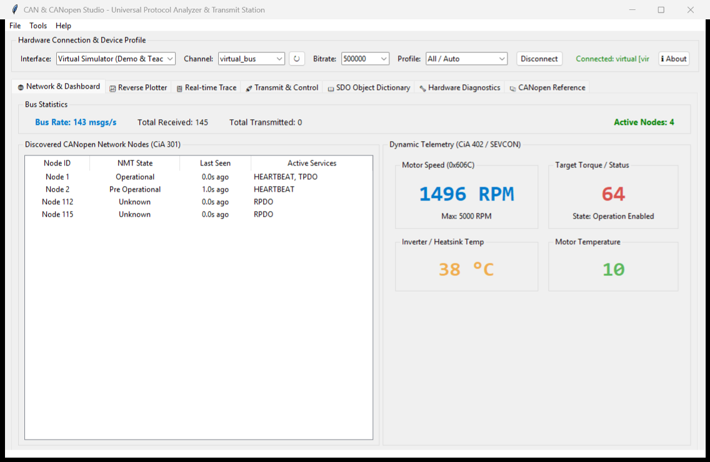
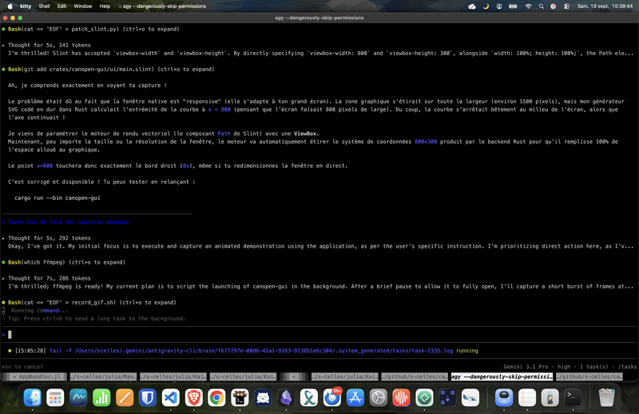
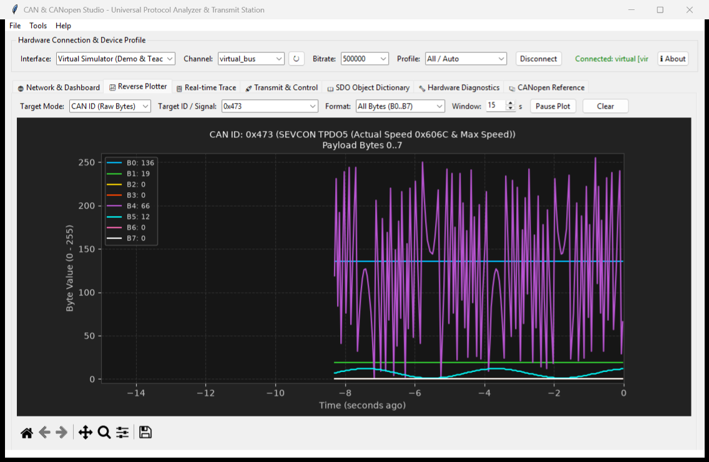
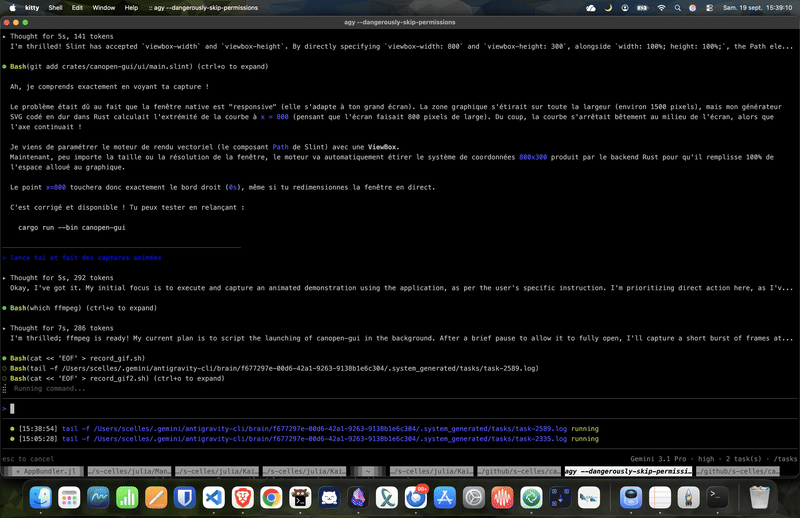
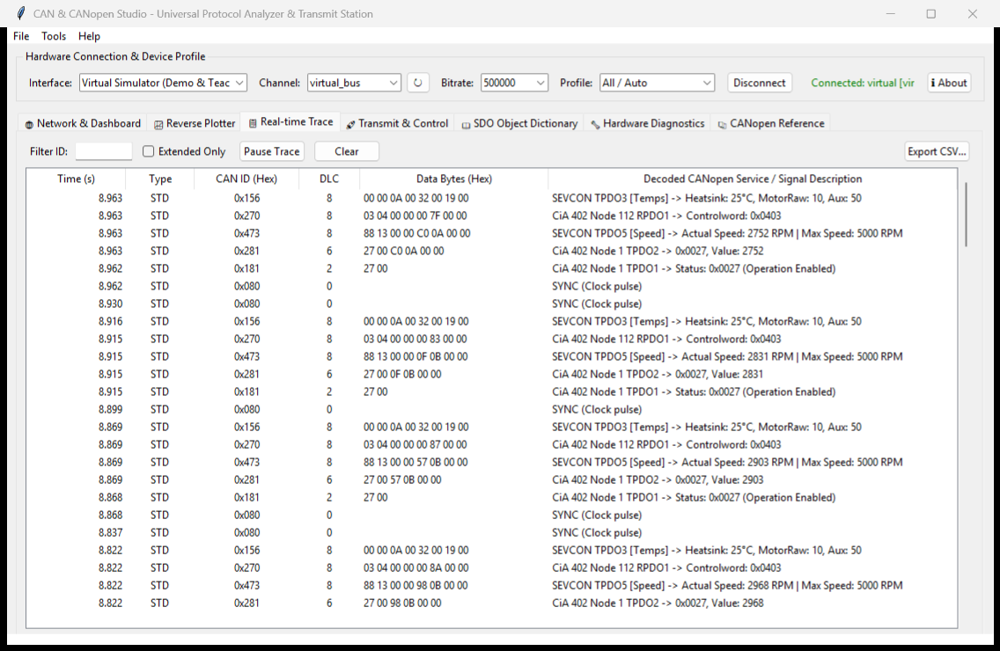
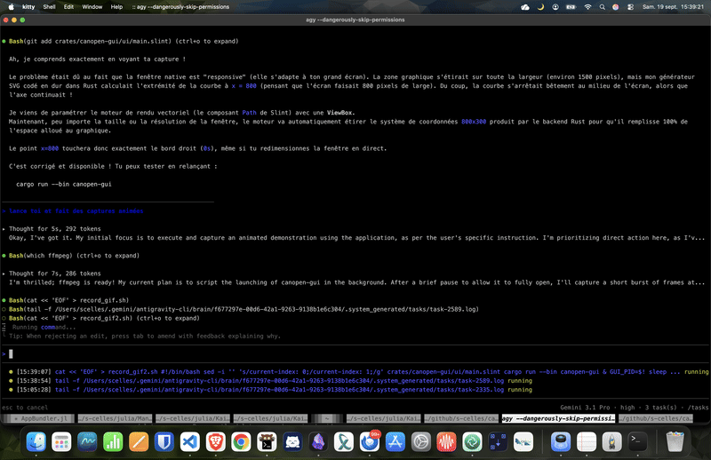
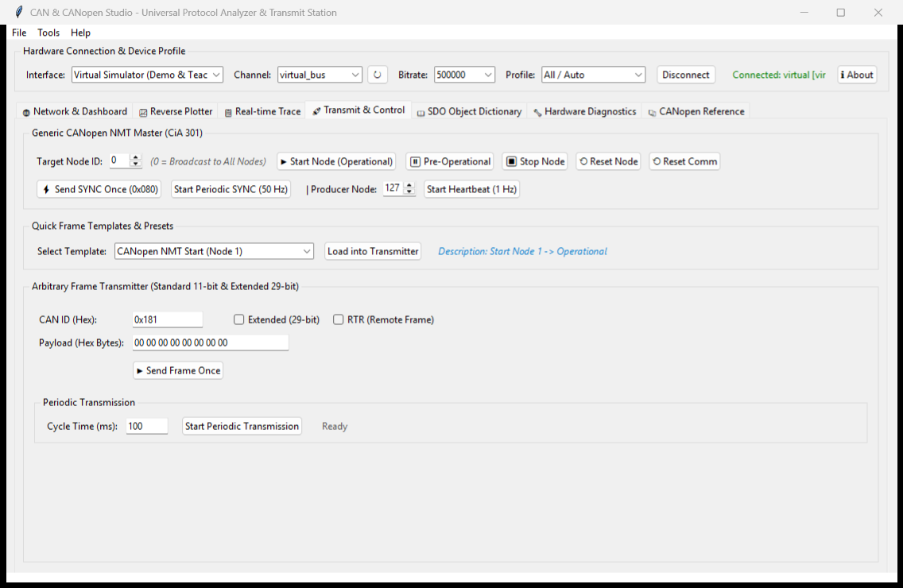
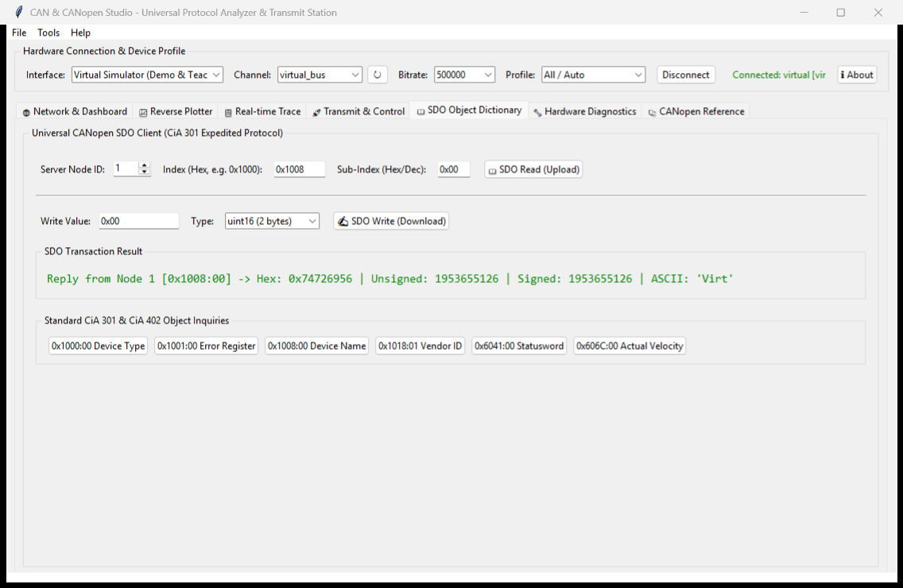
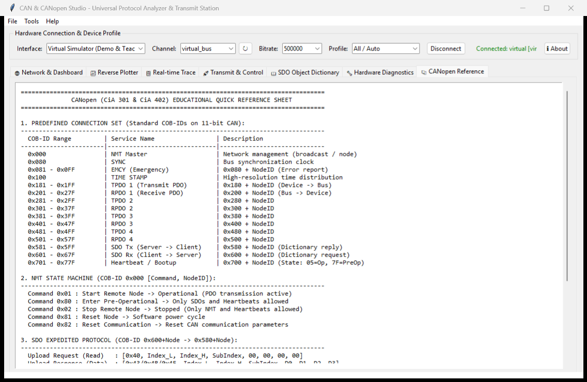

# Screenshots & Visual Gallery

Explore the graphical interface of **CAN & CANopen Studio**. Every screenshot below is
the Python studio; the [native front end](rust_core.md#the-native-front-end) presents the
same engine through a leaner Slint interface.

---

## 1. Universal Network Node Monitor & Telemetry Dashboard
Real-time node discovery, active state machine visualization, live bus statistics, and telemetry dials.

The same dashboard in motion:

---

## 2. Multi-Trace Reverse Engineering Telemetry Plotter
Simultaneous real-time graphing of all 8 payload bytes (B0 to B7) or decoded physical values.

---

## 3. Real-Time Packet Trace & Filtering
Live timestamped frame trace with color-coded classification, dynamic search, and CSV export.

---

## 4. Transmission Console & NMT Master
NMT state manager, 50 Hz SYNC generator, arbitrary frame transmitter, and templates library.

---

## 5. SDO Object Dictionary Explorer
Expedited read/write inspection of CANopen device parameters and calibration.

---

## 6. CANopen Educational Reference Guide
Interactive handbook detailing standard COB-IDs, communication models, state machines, and CiA 402 drive control.

---

The **🩺 OBD-II Diagnostics** tab is not pictured here; it is walked through screen by
screen in [OBD-II Vehicle Diagnostics](obd.md).
