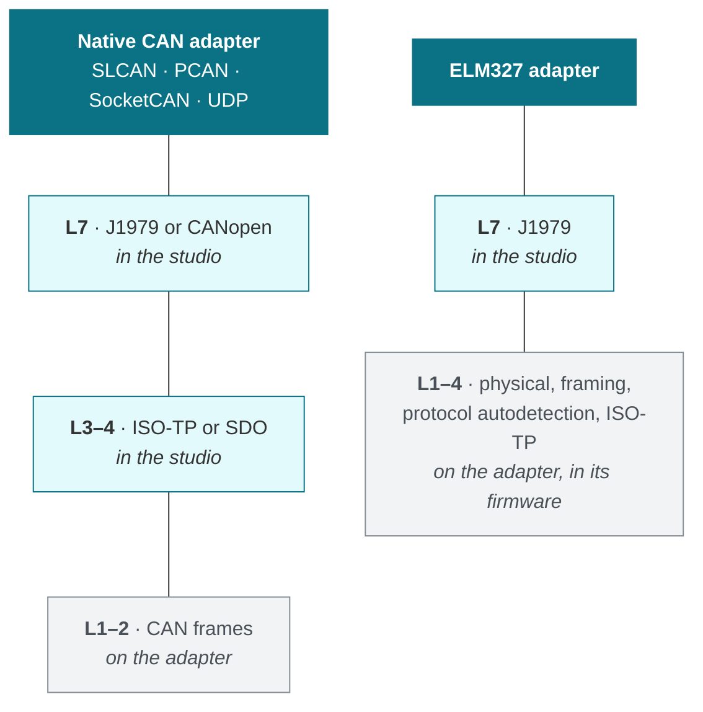

# Protocol Layers (OSI Model)

The studio speaks three protocol families over the same pair of wires: plain
**CAN**, **CANopen** and **OBD-II**. They are not alternatives to one another.
They share the bottom two layers entirely and differ only in what they put on
top — which is why one adapter, one capture and one decoder stack can serve all
three.

This page maps each of them onto the OSI reference model, and names the
standard that governs every box.

## The two stacks side by side

<svg class="osi-diagram" xmlns="http://www.w3.org/2000/svg" viewBox="0 0 960 760" font-family="Segoe UI, Helvetica, Arial, sans-serif" role="img" aria-label="CAN, CANopen and OBD-II mapped onto the seven layers of the OSI model">
  <title>CAN, CANopen and OBD-II in the OSI model</title>
  <rect class="bg" x="0" y="0" width="960" height="760"/>
  <text class="txt" x="105" y="52" font-size="15" font-weight="700" text-anchor="middle">OSI model</text>
  <text class="h-co" x="385" y="44" font-size="16" font-weight="700" text-anchor="middle">CANopen stack</text>
  <text class="muted" x="385" y="62" font-size="12" text-anchor="middle">industrial automation, CiA 301</text>
  <text class="h-obd" x="760" y="44" font-size="16" font-weight="700" text-anchor="middle">OBD-II over CAN stack</text>
  <text class="muted" x="760" y="62" font-size="12" text-anchor="middle">vehicle diagnostics, ISO 15765-4</text>
  <g font-size="13" font-weight="600">
    <rect class="osi" x="20" y="85" width="170" height="62" rx="6"/>
    <text class="txt" x="105" y="121" text-anchor="middle">7 &#183; Application</text>
    <rect class="osi" x="20" y="155" width="170" height="62" rx="6"/>
    <text class="txt" x="105" y="191" text-anchor="middle">6 &#183; Presentation</text>
    <rect class="osi" x="20" y="225" width="170" height="62" rx="6"/>
    <text class="txt" x="105" y="261" text-anchor="middle">5 &#183; Session</text>
    <rect class="osi" x="20" y="295" width="170" height="62" rx="6"/>
    <text class="txt" x="105" y="331" text-anchor="middle">4 &#183; Transport</text>
    <rect class="osi" x="20" y="365" width="170" height="62" rx="6"/>
    <text class="txt" x="105" y="401" text-anchor="middle">3 &#183; Network</text>
    <rect class="osi" x="20" y="435" width="170" height="62" rx="6"/>
    <text class="txt" x="105" y="471" text-anchor="middle">2 &#183; Data link</text>
    <rect class="osi" x="20" y="505" width="170" height="135" rx="6"/>
    <text class="txt" x="105" y="577" text-anchor="middle">1 &#183; Physical</text>
  </g>
  <rect class="co" x="210" y="85" width="350" height="62" rx="6"/>
  <text class="txt" x="385" y="104" font-size="13" font-weight="700" text-anchor="middle">CiA 301: CANopen application layer</text>
  <text class="txt" x="385" y="121" font-size="12" text-anchor="middle">Object dictionary, NMT, SDO, PDO, SYNC, EMCY</text>
  <text class="muted" x="385" y="138" font-size="12" text-anchor="middle">Profiles: CiA 401 (I/O), CiA 402 (drives), ...</text>
  <rect class="empty" x="210" y="155" width="350" height="272" rx="6"/>
  <text class="muted" x="385" y="272" font-size="13" font-weight="600" text-anchor="middle">Layers 3 to 6 not used</text>
  <text class="muted" x="385" y="294" font-size="12" text-anchor="middle">The application sits directly on</text>
  <text class="muted" x="385" y="311" font-size="12" text-anchor="middle">the CAN data link layer</text>
  <text class="muted" x="385" y="328" font-size="12" text-anchor="middle">(SDO handles its own segmentation)</text>
  <rect class="obd" x="580" y="85" width="360" height="62" rx="6"/>
  <text class="txt" x="760" y="104" font-size="13" font-weight="700" text-anchor="middle">SAE J1979 / ISO 15031-5: OBD services</text>
  <text class="txt" x="760" y="121" font-size="12" text-anchor="middle">Services 01 to 0A, PIDs (RPM, speed, coolant temp...)</text>
  <text class="muted" x="760" y="138" font-size="12" text-anchor="middle">Trouble codes (DTC): SAE J2012 / ISO 15031-6</text>
  <rect class="empty" x="580" y="155" width="360" height="132" rx="6"/>
  <text class="muted" x="760" y="226" font-size="13" font-weight="600" text-anchor="middle">Layers 5 and 6 not used</text>
  <rect class="obd" x="580" y="295" width="360" height="132" rx="6"/>
  <text class="txt" x="760" y="330" font-size="13" font-weight="700" text-anchor="middle">ISO 15765-2 (ISO-TP)</text>
  <text class="txt" x="760" y="352" font-size="12" text-anchor="middle">Segmentation: SF, FF, CF frames + FC flow control</text>
  <text class="txt" x="760" y="371" font-size="12" text-anchor="middle">Messages up to 4095 bytes</text>
  <text class="muted" x="760" y="390" font-size="12" text-anchor="middle">Normal (11-bit) or normal fixed (29-bit) addressing</text>
  <rect class="can" x="210" y="435" width="730" height="62" rx="6"/>
  <text class="h-can" x="575" y="459" font-size="14" font-weight="700" text-anchor="middle">CAN &#183; ISO 11898-1: classic CAN (2.0A 11-bit / 2.0B 29-bit) and CAN FD</text>
  <text class="txt" x="575" y="480" font-size="12" text-anchor="middle">Non-destructive bit-wise arbitration (CSMA/CR), CRC, ACK acknowledgement, bit stuffing, error handling</text>
  <rect class="can" x="210" y="505" width="730" height="135" rx="6"/>
  <text class="h-can" x="575" y="527" font-size="13" font-weight="700" text-anchor="middle">ISO 11898-2: high-speed CAN, CAN_H / CAN_L differential pair</text>
  <text class="txt" x="575" y="546" font-size="12" text-anchor="middle">120 &#937; termination at each end of the bus</text>
  <rect class="sub" x="222" y="558" width="326" height="70" rx="5"/>
  <text class="h-co" x="385" y="578" font-size="12" font-weight="600" text-anchor="middle">CiA 303-1: connectors SUB-D9, M12, ...</text>
  <text class="txt" x="385" y="597" font-size="12" text-anchor="middle">SUB-D9: CAN_L pin 2, CAN_H pin 7</text>
  <text class="txt" x="385" y="616" font-size="12" text-anchor="middle">Bit rate: 10 kbit/s to 1 Mbit/s</text>
  <rect class="sub" x="592" y="558" width="336" height="70" rx="5"/>
  <text class="h-obd" x="760" y="578" font-size="12" font-weight="600" text-anchor="middle">SAE J1962: 16-pin OBD connector</text>
  <text class="txt" x="760" y="597" font-size="12" text-anchor="middle">CAN_H pin 6, CAN_L pin 14</text>
  <text class="txt" x="760" y="616" font-size="12" text-anchor="middle">Bit rate: 250 or 500 kbit/s (ISO 15765-4)</text>
  <text class="txt" x="20" y="675" font-size="13" font-weight="700">CAN identifiers</text>
  <text class="txt" x="20" y="697" font-size="12"><tspan class="h-co" font-weight="600">CANopen:</tspan> 11-bit COB-ID = function code (4 bits) + Node-ID (7 bits)</text>
  <text class="txt" x="100" y="715" font-size="12">e.g. NMT 0x000, TPDO1 0x180 + ID, SDO 0x600 / 0x580 + ID, Heartbeat 0x700 + ID</text>
  <text class="txt" x="20" y="737" font-size="12"><tspan class="h-obd" font-weight="600">OBD-II:</tspan> functional request 0x7DF, ECU responses 0x7E8 to 0x7EF (29-bit: request 0x18DB33F1, responses 0x18DAF1xx)</text>
</svg>

## Reading the diagram

**The bottom two layers are common ground.** A CANopen drive and a car's engine
ECU put electrically indistinguishable frames on the wire. Everything the
studio does below the application layer — capture, timestamping, the trace, the
bit-level view, the PCAP-NG export — therefore works the same for both.

**Layers 3 to 6 are mostly empty, and that is the interesting part.** A classic
CAN frame carries at most eight bytes and there is nowhere to put a longer
message, so any protocol needing more has to invent its own segmentation:
CANopen does it with segmented and block SDO transfers, OBD-II with ISO-TP.
They solve the same problem in incompatible ways, which is why reading a VIN
and reading an object dictionary entry share no code above the data link layer.

**Layer 7 is where the two part company**, and plain CAN has nothing there at
all: outside a higher-layer protocol an identifier means whatever the designer
decided, which is why the studio ships [decoders](decoders.md) for specific
devices rather than a universal one.

!!! note "CAN FD does not add a layer"
    CAN FD changes layers 1 and 2 only — a second bit rate for the data phase,
    payloads to 64 bytes, different CRCs. Everything above is unchanged, which
    is why a protocol written for classic CAN keeps working over it.

## Where an adapter cuts the stack

Which layers the adapter implements, and which are left to the studio, decides
what an adapter can be used for. This is the distinction behind the two
diagnostic backends described in [OBD-II Vehicle Diagnostics](obd.md).

A **native CAN adapter** is transparent: it hands over raw frames and the studio
owns everything from ISO-TP upwards. That is why the same adapter serves
CANopen, OBD-II and the raw trace at once.

An **ELM327** is not transparent. It runs protocol autodetection and ISO-TP
inside its own firmware and answers in ASCII hexadecimal, so it can only ever
be a diagnostic endpoint — never a source of raw frames for the trace, the
plotter or the bridge. That is the reason `DiagnosticInterface` is a separate
abstraction from the CAN adapter catalogue rather than another entry in it.

## Standards referenced here

| Standard | Layer | What it defines |
| :--- | :---: | :--- |
| ISO 11898-1 | 2 | CAN data link layer; CAN FD since the 2015 edition |
| ISO 11898-2 | 1 | High-speed CAN physical layer |
| ISO 11898-3 | 1 | Low-speed, fault-tolerant CAN physical layer |
| ISO 15765-2 | 3–4 | ISO-TP: segmentation and flow control over CAN |
| ISO 15765-4 | 1–2 | Constrains CAN for road-vehicle diagnostics |
| ISO 15031-5 / SAE J1979 | 7 | Emissions-related diagnostic services |
| ISO 14229 | 7 | UDS, manufacturer diagnostic services |
| CiA 301 | 3–4, 7 | CANopen application layer and communication profile |
| CiA 306 | — | EDS file format describing a device's object dictionary |
| CiA 402 | 7 | CANopen device profile for drives and motion control |

!!! warning "K-line and J1850 are out of scope"
    OBD-II predates CAN and permits other physical layers. The studio implements
    the CAN protocols of ISO 15765-4 only. A session that autodetects ISO 9141-2,
    ISO 14230-4 or J1850 reports which protocol it found and stops, rather than
    mis-parsing a differently framed reply.
