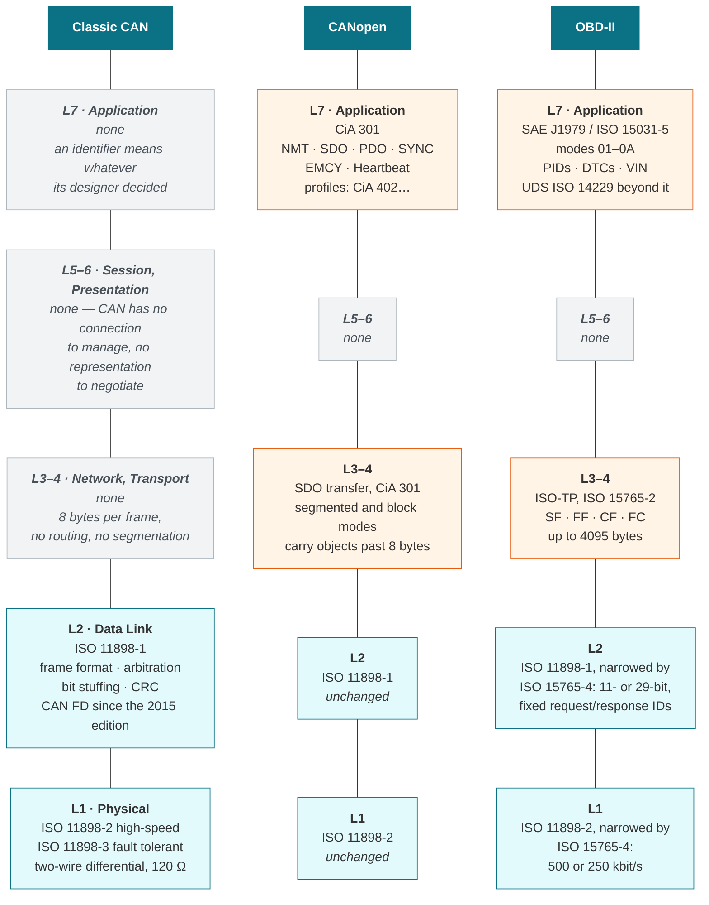
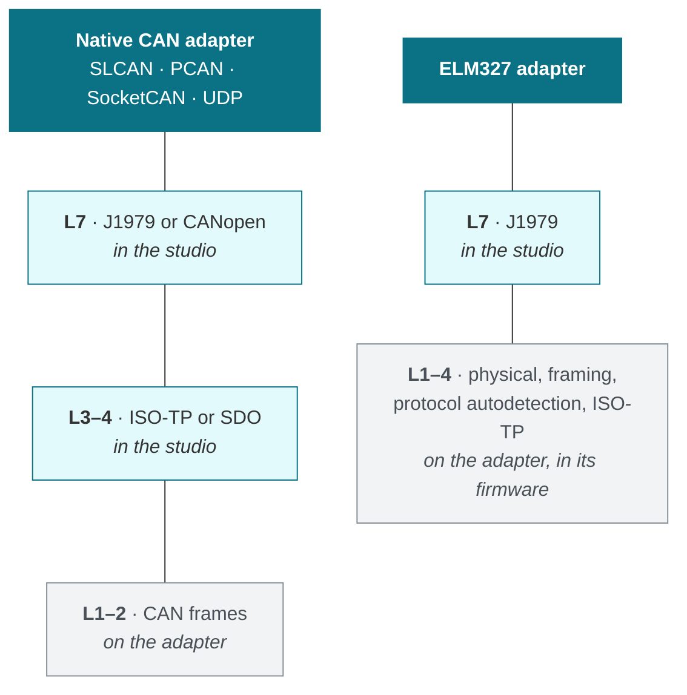

# Protocol Layers (OSI Model)

The studio speaks three protocol families over the same pair of wires: plain
**CAN**, **CANopen** and **OBD-II**. They are not alternatives to one another.
They share the bottom two layers entirely and differ only in what they put on
top — which is why one adapter, one capture and one decoder stack can serve all
three.

This page maps each of them onto the OSI reference model, and names the
standard that governs every box.

## The three stacks side by side

## Reading the diagram

**The bottom two layers are common ground.** A CANopen drive and a car's engine
ECU put electrically indistinguishable frames on the wire. Everything the
studio does below the application layer — capture, timestamping, the trace, the
bit-level view, the PCAP-NG export — therefore works the same for all three.

**Layers 3 to 6 are mostly empty, and that is the interesting part.** A classic
CAN frame carries at most eight bytes and there is nowhere to put a longer
message, so any protocol needing more has to invent its own segmentation:
CANopen does it with segmented and block SDO transfers, OBD-II with ISO-TP.
They solve the same problem in incompatible ways, which is why reading a VIN
and reading an object dictionary entry share no code above the data link layer.

**Layer 7 is where the three part company.** Classic CAN has nothing there at
all: an identifier means whatever the designer decided, which is why the studio
ships [decoders](decoders.md) for specific devices rather than a universal one.

!!! note "CAN FD does not add a layer"
    CAN FD changes layers 1 and 2 only — a second bit rate for the data phase,
    payloads to 64 bytes, different CRCs. Everything above is unchanged, which
    is why a protocol written for classic CAN keeps working over it.

## Where an adapter cuts the stack

Which layers the adapter implements, and which are left to the studio, decides
what an adapter can be used for. This is the distinction behind the two
diagnostic backends described in [OBD-II Vehicle Diagnostics](obd.md).

A **native CAN adapter** is transparent: it hands over raw frames and the studio
owns everything from ISO-TP upwards. That is why the same adapter serves
CANopen, OBD-II and the raw trace at once.

An **ELM327** is not transparent. It runs protocol autodetection and ISO-TP
inside its own firmware and answers in ASCII hexadecimal, so it can only ever
be a diagnostic endpoint — never a source of raw frames for the trace, the
plotter or the bridge. That is the reason `DiagnosticInterface` is a separate
abstraction from the CAN adapter catalogue rather than another entry in it.

## Standards referenced here

| Standard | Layer | What it defines |
| :--- | :---: | :--- |
| ISO 11898-1 | 2 | CAN data link layer; CAN FD since the 2015 edition |
| ISO 11898-2 | 1 | High-speed CAN physical layer |
| ISO 11898-3 | 1 | Low-speed, fault-tolerant CAN physical layer |
| ISO 15765-2 | 3–4 | ISO-TP: segmentation and flow control over CAN |
| ISO 15765-4 | 1–2 | Constrains CAN for road-vehicle diagnostics |
| ISO 15031-5 / SAE J1979 | 7 | Emissions-related diagnostic services |
| ISO 14229 | 7 | UDS, manufacturer diagnostic services |
| CiA 301 | 3–4, 7 | CANopen application layer and communication profile |
| CiA 306 | — | EDS file format describing a device's object dictionary |
| CiA 402 | 7 | CANopen device profile for drives and motion control |

!!! warning "K-line and J1850 are out of scope"
    OBD-II predates CAN and permits other physical layers. The studio implements
    the CAN protocols of ISO 15765-4 only. A session that autodetects ISO 9141-2,
    ISO 14230-4 or J1850 reports which protocol it found and stops, rather than
    mis-parsing a differently framed reply.
